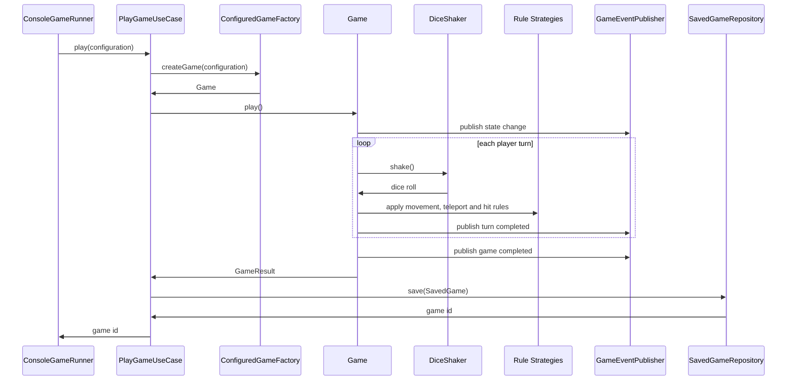
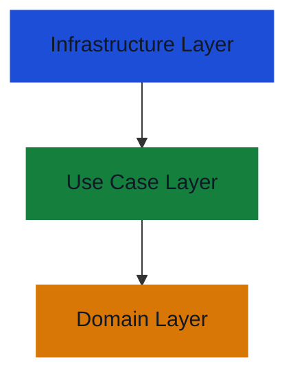

# Software Design and Architecture Assignment

## 1. Overview

This is a Java console application that simulates the board game from the assessment brief.
It runs the configured game scenarios, prints the progress of each game, saves completed games, and replays saved games
using the original configuration and dice rolls.

The `domain` package contains the board, players, dice, paths game state machine.
The `usecase` package coordinates playing and replaying games.
The `infrastructure` package contains Spring configuration, console output, scenerio setup, factories, registries and
persistence adapters.

The implementation supports the required variations: single or double, standard or exact-end movement, ignored or
forfeit-on-hit behaviour, ignored or active wormholes, and two-player or four-player board setups.
It also attempts the advanced state machine and save/replay features.

## 2. Key Classes And Responsibilities

The main domain class is `Game`. It coordinates the gameplay loop, tracks the current player, counts turns, applies the
selected rules correctly, detects the winner and publishes games events.

`Board` represents the size and numbered positions of the board. It is responsible for checking whether positions are
valid and for validating and storing wormhole positions.

`Player` represents a player. It stores the name, generated path, current path index and turn count. It does not decide
how movement, hits or teleports work.

`Game Configuration` describes one game setup. It stores board size, number of players, dice type, rule types and
configured wormholes. This allows game scenarios to change.

Rules interfaces `MovementRule`, `HitRule` and `TeleportRule` represent the main gameplay variations. Their concrete
implementations define if the game uses standard or exact-end movement, ignored or forfeit-on-hit behaviour, and ignored
or active wormholes.

`PathStrategy` create a route followed by each player. This is important as players can start from different corners and
move in different directions. The path logic also supports flexible board sizes instead of hardcoding fixed sizes.

`DiceShaker` represents dice rolling. Random dice shakers are used for normal play, while `FixedDiceShaker` is used for
testing, demonstrating scenarios and replay.

The state classes `ReadyState`, `InPlayState` and `GameOverState` represent the lifecycle of a game. They are used so
the game can move through the required states and reject extra play attempts after the game has ended.

At the use case layer, `PlayGameUseCase` runs a configured game and saves the result. `ReplayGameUseCase` loads a saved
game and replays it using the saved configuration and dice rolls.

`SavedGameRepository` is the persistence port. The in-memory repository and JSON file repository are infrastructure
adapters. This means the storage can be changed without changing the domain or use case code.

## 3. Successful Execution Flow

The execution starts in `ConsoleGameRunner`, which acts as the console driving adapter. It asks the
`GameScenarioProvider` for the configured scenario and then passes each `GameConfiguration` to `PlayGameUseCase`.

Once the `Game` has been created, the use case calls `play()`. The game changes from ready to in-play state and then
players take turns until a player reaches their end position.

On each turn, the current player rolls the dice using `DiceShaker`. The selected `MovementRule` moves the player along
their path. After movement, the selected `TeleportRule` checks if the player has landed on a wormhole. The selected
`HitRule` then checks whether the move has caused a hit with another player.

During the game, domain events are published through `GameEventPublisher`. The domain does not print to the console
directly. Instead, the infrastructure observer receives the events and formats the console output.

When a player wins, the games changes to the game-over state and returns a `GameResult`. `PlayGameUseCase` then saves
the completed game through `SavedGameRepository` port. The repository stores the game configuration and dice rolls so
that the game can be replayed later.



## 4. Variations and Advanced Features

### Dice Variation

The game supports both single six-sided die and two six-sided dice. This is reprented by `DiceType`.
Random dice for normal simulation runs and fixed dice for demonstration scenarios, testing and replaying.

### Exact End Variation

The movement rule is selected through `Movement Rule`.
`StandardEndMovementRule` allows player to win by landing on or overshooting the end position.
`ExactEndBounceMovementRule` requires the play to land on the end position. If overshoots the player bounces back along
the same path.

### Hit Variation

The hit rule is selected through `HitRule`.
`IgnoreHitRule` allows more than one player to occupy the same board position.
`ForfeitOnHitRule` makes the player return to position they were on before if they land on another player.

### Teleport Variation

The teleport rule is selected through `Teleport Rule`
`IgnoreTeleportRule` means wormholes exist on the board but have no effect when a player lands on them.
`WormholeTeleportRule` moves a player from one end of a wormhole to the other. Wormholes are configured as pairs of
board positions.

### Large Board and Four Players

The implementation supports two and four player games. Two-player using Red and Blue players and four-players using Red,
Blue, Yellow and Green player.
The design uses path strategies to generate players path from the board size and starting corner making the board size
and number of players variable.

### Game State Advanced Feature

A new game starts in the ready state. When play begins it moves into the in-play state. When a player wins it moves into
the game-over state.
If extra play attempts are made after the game has ended remaining turns output a game-over message.

### Save and Replay Advanced Feature

The implementation supports the save and replay feature. When a game finishes, the use case saves `SavedGame` containing
the original `GameConfiguration` and the dice rolls.
When replay is requested, `ReplayGameUseCase` loads the saved game, rebuilds the game using the saved game configuration
and uses fixed dice to replay the same dice sequence.

## 5. Design Patterns Used

### Strategy Pattern

The Strategy pattern is used for the main rule variations.
The concrete Strategies are:

- `StandardEndMovementRule` and `ExactEndBounceMovementRule`
- `IgnoreHitRule` and `ForfeitOnHitRule`
- `IgnoreTeleportRule` and `WormholeTeleportRule`

This means different rule combinations can be selected without changing the main game loop.

Dice rolling also uses Strategy. `Game` depends on `DiceShaker`, while `RandomSingleDiceShaker` and `FixedDiceShaker`
provide different concrete rolling behaviour.

`PathStrategy` is another use of Strategy.
Instead of hardcoding Red, Blue, Green and Yellow paths, the path strategies generate paths from the board size and
starting corner.
This supports the boustrophedon track, odd/even row behaviour and flexible board sizes without duplicating path lists.

### Decorator Pattern

`ReversePathDecorator` uses the Decorator pattern
It wraps an `existing `PathStrategy` and reverses the generated path. This reverses the path without changing the
original strategy class or duplicating the path algorithm.

### State Pattern

The State pattern is used for the game state machine.
`GameState` is the abstract state interface. `ReadyState`, `InPlayState` and `GameOverState` are concrete states.
This models the state transition explicitly opposed to using a boolean.

### Factory Pattern

Factory classes are used to create configured objects.
`ConfiguredGame` creates a complete `Game` from a `GameConfiguration`.
`PlayerFactory` creates the correct players for two-player and four-player games.
Dice shaker factories create the selected dice implementation.

### Repository pattern

The Repository pattern is used for saved games.
`SavedGameRepository` is the abstract repository interface. The in-memory and JSON file repositories are concrete
implementations.
The use case depends on the repository abstraction, so the persistence mechanism can change without the application
logic.

### Observer Pattern

The Observer pattern is used for output.
The domain publishes events through `GameEventPublisher`. The console observer receives those events and formats them
for the console.

### Value Object

`GameConfiguration` describes a game setup. `Wormhole` describes a pair of connected board positions. Result objects
such as `MoveResult`, `HitResult`, `TeleportResult` and `TurnResult` describe waht happened during a turn.
These objects group related values together and make method contracts clearer.

### Registry Classes

`RuleRegisty` and `DiceShakerFactoryRegistry` are supporting design classes.
They map configuration values to the correct concrete rule or factory. This keeps selection logic in one place and
avoids spreading configuration `switch` statements through the use cases or domain.

## 6. SOLID Principles

### Single Responsibility Principle

Each main class has one main reason to change.
`Game` coordinates the gameplay flow.
`Board` manages board size, positions and wormholes.
`Player` manages one player's path position and turn count.
`ConsoleGameEventObserver` is responsible for console output.
`JsonFileSavedGameRepository` is responsible for JSON file persistence.
This separation keep domain logic, presentation and persistence in different classes.

### Open/Closed principle

`Game` is open to new rule behaviour as it works with the `MovementRule`, `HitRule`, `TeleportRule` and `DiceShaker`
abstractions.
New movement, hit, teleport or dice behaviour can be added as concrete implementations without rewriting the main game
loop.

### Liskov Substitution Principle

Concrete implementations can be used through their abstract interfaces.
For example, `StandardEndMovement` and `ExactEndBounceMovementRule` can both be used wherever a `MovementRule` is
required.
The rest of the application should not need to know which implementation has been given.

### Interface Segregation Principle

`MovementRule`, `HitRule`, `TeleportRule`, `DiceShaker`, `GameEventPublisher` and `SavedGameRepository` each describe a
narrow contract.
Classes only depend on the operations they actually need, rather than one large interface covering unrelated behaviour.

### Dependency Inversion Principle

The domain and use case classes depend on abstract interfaces, while the concrete implementations are supplied from the
outside by String Dependency Injection container.
For example, `Game` depends on `MovementRule`, `HitRule`, `TeleportRule`, `DiceShaker` and `GameEventPublisher`.
The use case depends on `GameFactory` and `SavedGameRepository`, rather than directly creating infrastructure classes.

## 7. Clean Architecture / Ports And Adapters

The main rule is that dependencies point inwards.
The `domain` package contains the enterprise and game rules. It has no dependency on Spring, console output or file
storage.
The `usecase` package contains application-specific use cases. It coordinates playing and replaying games, but it still
does not know how games are printed or where saved games are stored.
The `infrastructure` package contains technology details. This includes Spring configuration, console output, scenario
setup, factories, registries and persistence adapters.

### Dependency direction



The domain does not depend on the use case layer.
The use case layer does not depend on concrete infrastructure classes.
The use cases depend on ports, which are abstract interfaces. The infrastructure layer provides adapters that implement
those ports.

| Port                  | Adapter                         | Purpose                                                |
|-----------------------|---------------------------------|--------------------------------------------------------|
| `PlayGame`            | `PlayGameUseCase`               | Provides the play use case to the console runner       |
| `ReplayGame`          | `ReplayGameUseCase`             | Provides the replay use case to the console runner     |
| `GameFactory`         | `ConfiguredGameFactory`         | Creates a configured `Game` from a `GameConfiguration` |
| `SavedGameRepository` | `InMemorySavedGameRepository`   | Stores saved games in memory                           |
| `SavedGameRepository` | `JsonFileSavedGameRepository`   | Stores saved games in a JSON file                      |
| `GameEventPublisher`  | `ApplicationGameEventPublisher` | Publishes domain events through Spring                 |
| `GameOutputWriter`    | `ConsoleGameOutputWriter`       | Writes formatted output to the console                 |

`ConsoleGameRunner` is a driving adapter. It starts the application from the console side and calls the play and replay
use case ports.
`InMemorySavedGameRepository` and `JsonFileSavedGameRepository` are driven adapters. They are called by the use cases
through the`SavedGameRepository` port.
The JSON file adapter can be swapped with the in-memory adapter using Spring profiles. This demonstrates that the use
case logic depends on the repository abstraction rather than on a specific storage mechanism

## 8. Contracts, Validation and Exceptions

A contract is what a class expects from callers and what callers can expect in return. Validation is used to protect
important preconditions and class invariants.
`IllegalArgurmentException` is used when a caller provides invalid input, such as an invalid board size, invalid dice
roll, invalid rule type or invalid wormhole.
`IllegalStateException` is used when the object is valid, but the operation is not valid in its current state. For
example, `FixedDiceShaker` throws this when no fixed dice rolls are left.
These checks are used where invalid input would break a class contract, corrupt game state or make replay unreliable.

## 9. Evaluation

The strongest part of the design is how variation is seperated from the main game flow. `Game` coordinates play, while
movement, hit, teleport, dice and path behaviour are handled by seperate abstractions
The most successful design choice is the path generation. Instead of hardcoding the example player paths, the project
generates paths from the board size and starting corner. This supports required board sizes and keeps the design open to
other valid board sizes.
The main weakness is that scenario setup is still hardcoded in the infrastructure layer. This is acceptable for
demonstrating but future versions could load scenarios from user input or a configured file.
I would also add more full-game combination tests. THe current tests covers rules and validation but more end-to-end
scenarios would give confidence all variations work together.

## 10. Running The Application

The project is a Maven Spring Boot console application.

To run the tests:

```text
cmd /c mvnw.cmd test
```

To run the application:

```text
cmd /c mvnw.cmd spring-boot:run
```

The default persistence profile saves completed games to a JSON file.

On Windows, the saved games file is written to:

```text
%USERPROFILE%\.sda\saved-games.json
```

The in-memory repository can also be used by running with the
`memory-persistence` Spring profile.

The application runs a sequence of scenarios that demonstrate the
required rule variations and the advanced save/replay feature.
