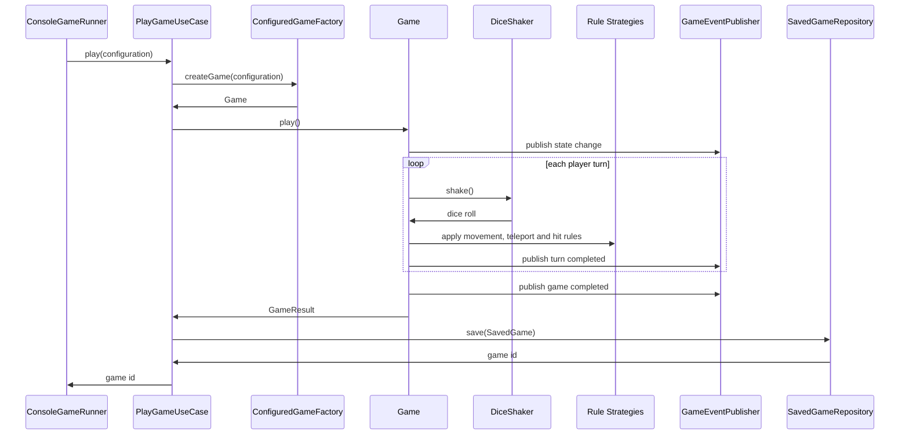
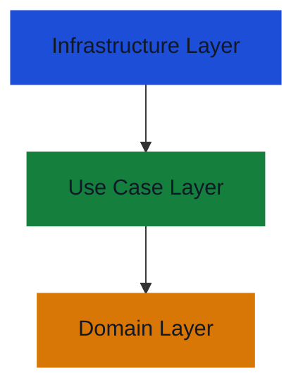

# Software Design and Architecture Assignment

## 1. Overview

This project is a Java Spring Boot console application that simulates the board game.
The application runs a set of demonstration games, prints each game to the console, saves completed games, and can replay a saved game using the original configuration and dice rolls.
The design follows the Clean Architecture / Ports and Adapters style.

| Package          | Responsibility                                                                           |
|------------------|------------------------------------------------------------------------------------------|
| `domain`         | Board, players, paths, dice contracts, rules, state machine and game logic               |
| `usecase`        | Application flow for playing, saving and replaying games                                 |
| `infrastructure` | Spring configuration, console output, scenario setup, factories and persistence adapters |

The implementation supports all required variations and also implements the advanced State pattern and save/replay features.

## 2. Key Classes And Responsibilities

The main static structure is split by responsibility. The domain classes model the game rules, while the use case and infrastructure classes coordinate application flow and technology details.

| Class / Interface             | Layer                  | Responsibility                                                                                              |
|-------------------------------|------------------------|-------------------------------------------------------------------------------------------------------------|
| `Game`                        | Domain                 | Coordinates turn order, dice rolls, rule application, winner detection, state transitions and domain events |
| `Board`                       | Domain                 | Stores board dimensions and validates board positions and wormholes                                         |
| `Player`                      | Domain                 | Stores a player's name, path, current path index and turn count                                             |
| `GameConfiguration`           | Domain                 | Value object describing board size, player count, dice type, rule types and wormholes                       |
| `MovementRule`                | Domain                 | Strategy interface for standard end or exact-end movement                                                   |
| `HitRule`                     | Domain                 | Strategy interface for ignored hits or forfeit-on-hit behaviour                                             |
| `TeleportRule`                | Domain                 | Strategy interface for ignored wormholes or active wormhole teleporting                                     |
| `DiceShaker`                  | Domain                 | Strategy interface for random and fixed dice rolling                                                        |
| `PathStrategy`                | Domain                 | Builds a player's boustrophedon path from the board size and starting corner                                |
| `GameState`                   | Domain                 | State interface for `ReadyState`, `InPlayState` and `GameOverState`                                         |
| `GameEventPublisher`          | Domain port            | Allows the domain to publish events without depending on Spring or console output                           |
| `PlayGameUseCase`             | Use case               | Runs a configured game and saves the completed result                                                       |
| `ReplayGameUseCase`           | Use case               | Loads a saved game and replays it using saved configuration and dice rolls                                  |
| `SavedGameRepository`         | Use case port          | Abstract repository contract for saving and loading games                                                   |
| `ConfiguredGameFactory`       | Infrastructure adapter | Builds a complete `Game` from a `GameConfiguration`                                                         |
| `ConsoleGameRunner`           | Infrastructure adapter | Starts the console demonstration and calls the use case ports                                               |
| `ConsoleGameEventObserver`    | Infrastructure adapter | Observes game events and writes readable console output                                                     |
| `JsonFileSavedGameRepository` | Infrastructure adapter | Persists saved games to a JSON file                                                                         |

The most important design decision is that `Game` depends on abstractions such as `MovementRule`, `HitRule`, `TeleportRule`, `DiceShaker` and `GameEventPublisher`. 
This keeps the main game loop stable while allowing rule, dice and output behaviour to vary.

## 3. Successful Execution Flow

A successful game is driven from the infrastructure layer into the use case layer, then into the domain model.

1. `ConsoleGameRunner` selects a demonstration scenario.
2. `PlayGameUseCase` asks `ConfiguredGameFactory` to create a `Game`.
3. `Game` starts in `ReadyState` and moves into `InPlayState`.
4. Each turn rolls dice, applies movement, teleport and hit rules, then publishes a turn event.
5. When a player reaches their end position, the game publishes a win event and moves to `GameOverState`.
6. `PlayGameUseCase` saves a `SavedGame` containing the configuration and dice rolls.
7. `ReplayGameUseCase` can rebuild the game and replay it using the saved dice sequence.



## 4. Variations and Advanced Features

Variations are selected through `GameConfiguration`, then mapped to the correct strategies by infrastructure factories and registries.

| Feature               | Implementation                                                                    | Design point                                                                    |
|-----------------------|-----------------------------------------------------------------------------------|---------------------------------------------------------------------------------|
| Single or double dice | `DiceType`, `RandomSingleDiceShaker`, `RandomDoubleDiceShaker`, `FixedDiceShaker` | Dice rolling is hidden behind the `DiceShaker` strategy interface               |
| Standard end          | `StandardEndMovementRule`                                                         | A player can win by landing on or overshooting the end position                 |
| Exact end             | `ExactEndBounceMovementRule`                                                      | Overshoots bounce back along the same player path                               |
| Ignored hits          | `IgnoreHitRule`                                                                   | Multiple players may occupy the same board position                             |
| Forfeit on hit        | `ForfeitOnHitRule`                                                                | A player that would hit another player returns to their start-of-turn position  |
| Ignored wormholes     | `IgnoreTeleportRule`                                                              | Wormholes can exist on the board but have no effect                             |
| Active wormholes      | `WormholeTeleportRule`                                                            | Landing on either endpoint moves the player to the other endpoint               |
| Two players           | `PlayerFactory.createTwoPlayerGamePlayers`                                        | Creates Red and Blue with opposite paths                                        |
| Four players          | `PlayerFactory.createFourPlayerGamePlayers`                                       | Creates Red, Blue, Yellow and Green from different starting corners             |
| Flexible board paths  | `PathStrategy` implementations                                                    | Paths are generated from board size rather than hardcoded strategies            |
| Game state            | `ReadyState`, `InPlayState`, `GameOverState`                                      | State pattern models the game lifecycle and handles extra turns after game over |
| Save and replay       | `SavedGameRepository`, `SavedGame`, `ReplayGameUseCase`                           | Replay stores configuration and dice rolls, then runs the game logic again      |

A key design choice is that the player paths are generated rather than written out as fixed lists. This still matches the 5x5 and 6x6 examples, but it keeps the design open to other board sizes and avoids duplicating long path definitions for each player.

## 5. Design Patterns Used

### Strategy Pattern

Strategy is used for `MovementRule`, `HitRule`, `TeleportRule`, `DiceShaker` and `PathStrategy`.
`Game` depends on these interfaces rather than concrete classes, so the same game loop can run different rule combinations by handling variation with polymorphism instead of large conditional statements.

### State Pattern
State is used through `GameState`, `ReadyState`, `InPlayState` and `GameOverState` making the game lifecycle explicit. Extra play attempts after the winner has been found are handled by `GameOverState` rather than having game-over checks throughout the code.

### Factory Pattern
Factories are used by `ConfiguredGameFactory`, `PlayerFactory`, `BoardFactory` and the dice factories.
They keep object construction separate from use case logic meaning the use case can ask for a configured game without directly creating boards, players, rules or dice.

### Repository Pattern
`SavedGameRepository` is the repository abstraction for save/replay.
`InMemorySavedGameRepository` and `JsonFileSavedGameRepository` are alternative adapters. The use cases can save and load games without knowing which storage mechanism is active.

### Observer Pattern
Observer is used through `GameEventPublisher` and `ConsoleGameEventObserver`.
The domain publishes events describing what happened. The infrastructure layer observes those events and prints them to the console, keeping output separate from game logic.

### Decorator Pattern
`ReversePathDecorator` wraps a `PathStrategy` and reverses its generated path.
This avoids duplicating the path-building algorithm when a player needs to follow an existing route in the opposite direction.

### Value Objects
`GameConfiguration`, `Wormhole`, `SavedGame` and the result records are used as value objects.
They group related values together and make the contracts between classes clearer, especially for configuration, replay and turn results.

## 6. SOLID Principles

### Single Responsibility Principle

Classes are kept focused so they have one main reason to change.
For example `Game` coordinates the gameplay flow, but it does not have to print console output or save files.
Those responsibilities are handled by infrastructure classes.

### Open/Closed principle

`Game` is open to new rule behaviour without changing its main loop. New movement, hit, teleport, dice or path behaviour can be added by creating another implementation of an existing interface such as `MovementRule`.

### Liskov Substitution Principle

Concrete implementations can be used through their abstract interfaces.
For example, `StandardEndMovementRule` and `ExactEndBounceMovementRule` can both be used wherever a `MovementRule` is
required.
The rest of the application should not need to know which implementation has been given.

### Interface Segregation Principle

Interfaces are focused contracts rather than one large general interface. `MovementRule`, `HitRule`, `TeleportRule`, `DiceShaker`, `GameFactory`, and `SavedGameRepository` each describe one role.
This means classes only depend on the operations they actually need.

### Dependency Inversion Principle

Higher-level code depends on abstractions. `Game` depends on rule, dice and event interfaces, while the use cases 
depend on `GameFactory` and `SavedGameRepository` ports. Spring Dependency Injection supplies the concrete infrastructure implementations from the outside.

## 7. Clean Architecture / Ports And Adapters

The main rule is that dependencies point inwards.
The `domain` package contains the enterprise and game rules. It has no dependency on Spring, console output or file
storage.
The `usecase` package contains application-specific use cases. It coordinates playing and replaying games, but it still
does not know how games are printed or where saved games are stored.
The `infrastructure` package contains technology details. This includes Spring configuration, console output, scenario
setup, factories, registries and persistence adapters.

### Dependency direction



The domain does not depend on the use case layer.
The use case layer does not depend on concrete infrastructure classes.
The use cases depend on ports, which are abstract interfaces. The infrastructure layer provides adapters that implement
those ports.

| Port                  | Adapter                         | Purpose                                                |
|-----------------------|---------------------------------|--------------------------------------------------------|
| `PlayGame`            | `PlayGameUseCase`               | Provides the play use case to the console runner       |
| `ReplayGame`          | `ReplayGameUseCase`             | Provides the replay use case to the console runner     |
| `GameFactory`         | `ConfiguredGameFactory`         | Creates a configured `Game` from a `GameConfiguration` |
| `SavedGameRepository` | `InMemorySavedGameRepository`   | Stores saved games in memory                           |
| `SavedGameRepository` | `JsonFileSavedGameRepository`   | Stores saved games in a JSON file                      |
| `GameEventPublisher`  | `ApplicationGameEventPublisher` | Publishes domain events through Spring                 |
| `GameOutputWriter`    | `ConsoleGameOutputWriter`       | Writes formatted output to the console                 |

`ConsoleGameRunner` is a driving adapter. It starts the application from the console side and calls the play and replay
use case ports.
`InMemorySavedGameRepository` and `JsonFileSavedGameRepository` are driven adapters. They are called by the use cases
through the `SavedGameRepository` port.
The JSON file adapter can be swapped with the in-memory adapter using Spring profiles. This demonstrates that the use
case logic depends on the repository abstraction rather than on a specific storage mechanism.

## 8. Contracts, Validation and Exceptions

A contract is what a class expects from callers and what callers can expect in return. Validation is used to protect
important preconditions and class invariants.
`IllegalArgumentException` is used when a caller provides invalid input, such as an invalid board size, invalid dice
roll, invalid rule type or invalid wormhole.
`IllegalStateException` is used when the object is valid, but the operation is not valid in its current state. For
example, `FixedDiceShaker` throws this when no fixed dice rolls are left.
These checks are used where invalid input would break a class contract, corrupt game state or make replay unreliable.

## 9. Evaluation

The strongest part of the design is how variation is separated from the main game flow. `Game` coordinates play, while
movement, hit, teleport, dice and path behaviour are handled by separate abstractions.
The most successful design choice is the path generation. Instead of hardcoding the example player paths, the project
generates paths from the board size and starting corner. This supports required board sizes and keeps the design open to
other valid board sizes.
The main weakness is that scenario setup is still hardcoded in the infrastructure layer. This is acceptable for
demonstrating but future versions could load scenarios from user input or a configured file.
I would also add more full-game combination tests. The current tests cover rules and validation but more end-to-end
scenarios would give confidence all variations work together.

## 10. Running The Application

The project is a Maven Spring Boot console application.

To run the tests:

```text
cmd /c mvnw.cmd test
```

To run the application:

```text
cmd /c mvnw.cmd spring-boot:run
```

The default persistence profile saves completed games to a JSON file.

On Windows, the saved games file is written to:

```text
%USERPROFILE%\.sda\saved-games.json
```

The in-memory repository can also be used by running with the
`memory-persistence` Spring profile.

The application runs a sequence of scenarios that demonstrate the
required rule variations and the advanced save/replay feature.
